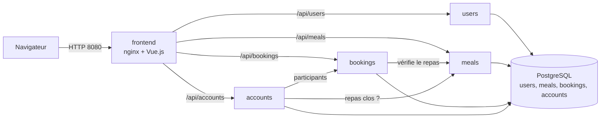

# Architecture

Le fichier `architecture.png` attendu par le cahier des charges est à exporter depuis ce schéma (par exemple avec mermaid.live) ou à dessiner dans draw.io.

```mermaid
flowchart LR
    B[Navigateur] -->|HTTP 8080| F[frontend<br/>nginx + Vue.js]
    F -->|/api/users| U[users]
    F -->|/api/meals| M[meals]
    F -->|/api/bookings| K[bookings]
    F -->|/api/accounts| A[accounts]
    K -->|vérifie le repas| M
    A -->|repas clos ?| M
    A -->|participants| K
    U --> P[(PostgreSQL<br/>users, meals, bookings, accounts)]
    M --> P
    K --> P
    A --> P
```
